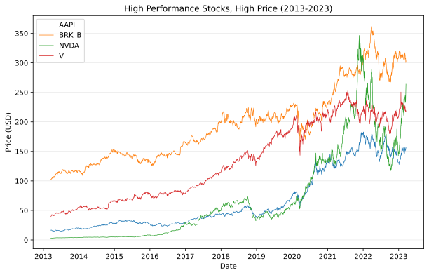
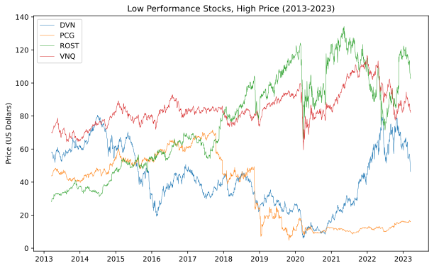
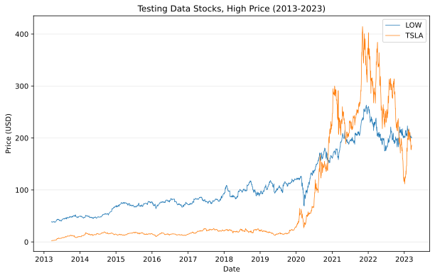
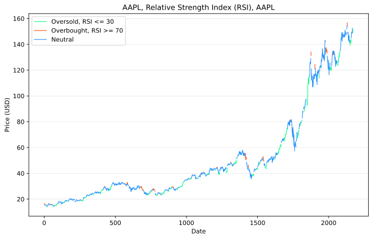
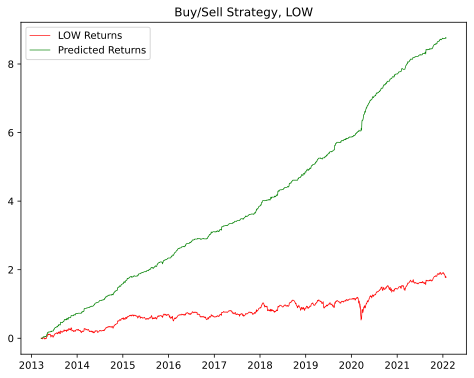
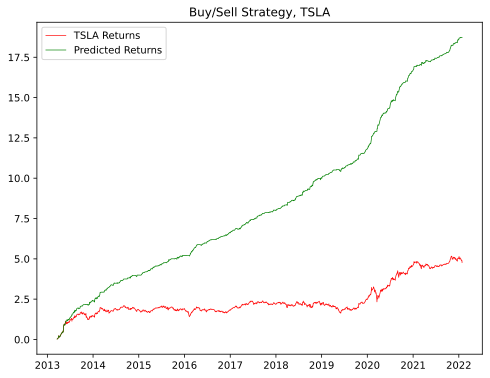

# Data Mining Course Project
## Overview
The goal of this project is to use data mining techniques to predict future stock prices.  We have collected 10 year historical data for 10 different stocks to use for training and testing. (8 for training, 2 for testing).

## Data
For this project we have collected historical stock data for 10 different stocks.  For each day we have attributes including opening price, closing price, # of trades, high price, and low price.  We have a split of 8 stocks for training the various models and 2 stocks for testing purposes.  The testing stocks are Lowes, a notoriously stable and well performing stock, and Tesla, a notoriously volatile stock.

## Visualizations






## Logistic Regression Model
### Features Used
- 5 Day SMA
- Open price
- Open Price - previous Open Price
- Relative Strength Index (RSI)

### Model Accuracy
```
LOW:
--------
[[646 391]
 [310 924]]

              precision    recall  f1-score   support

           0       0.68      0.62      0.65      1037
           1       0.70      0.75      0.72      1234

    accuracy                           0.69      2271
   macro avg       0.69      0.69      0.69      2271
weighted avg       0.69      0.69      0.69      2271

TSLA:
--------
[[624 456]
 [307 884]]

              precision    recall  f1-score   support

           0       0.67      0.58      0.62      1080
           1       0.66      0.74      0.70      1191

    accuracy                           0.66      2271
   macro avg       0.66      0.66      0.66      2271
weighted avg       0.66      0.66      0.66      2271
```

### Performance



## Stock Symbols (Bold indicates testing data)
- AAPL: Apple
- BRK/B: Berkshire Hathaway B
- DVN: Devon Energy
- **LOW: Lowes**
- NVDA: Nvidia
- PCG: Pacific Gas & Electric
- ROST: Ross
- **TSLA: Tesla**
- V: VISA
- VNQ: Vanguard Real Estate

## Sources
Stock price data is from [NASDAQ Historical Data](https://www.nasdaq.com/market-activity/quotes/historical)
