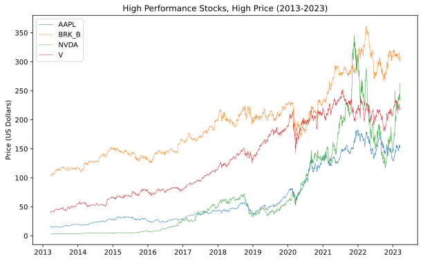
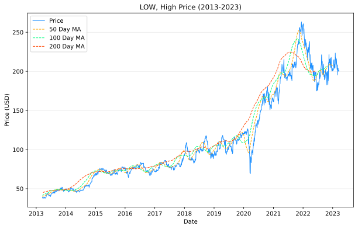

# Data Mining Course Project
## Overview
The goal of this project is to use data mining techniques to predict future stock prices.  We have collected 10 year historical data for 10 different stocks to use for training and testing. (8 for training, 2 for testing).

## Visualizations

## Stock Symbols
- AAPL: Apple
- BRK/B: Berkshire Hathaway B
- DVN: Devon Energy
- LOW: Lowes
- NVDA: Nvidia
- PCG: Pacific Gas & Electric
- ROST: Ross
- TSLA: Tesla
- V: VISA
- VNQ: Vanguard Real Estate

## Sources
Stock price data is from [NASDAQ Historical Data](https://www.nasdaq.com/market-activity/quotes/historical)
