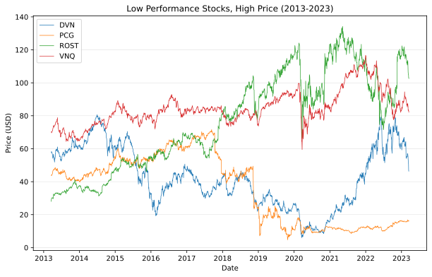
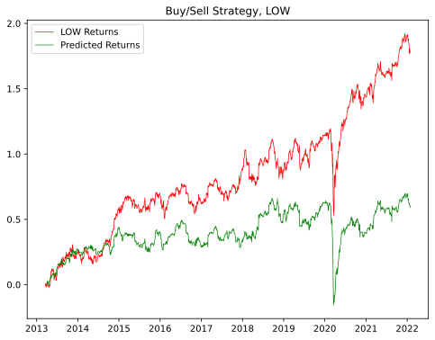
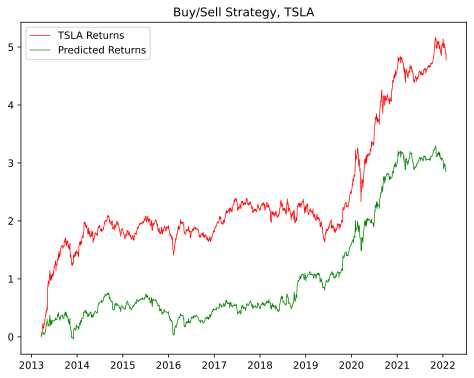
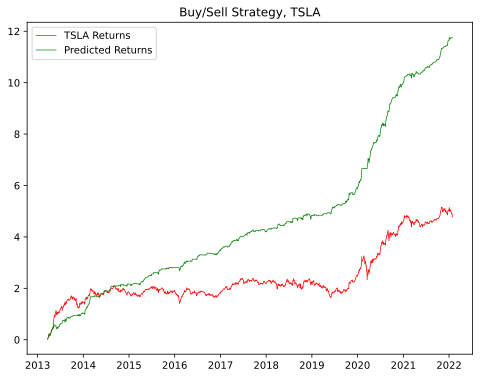

# Data Mining Course Project
## Overview
The goal of this project is to use data mining techniques to predict future stock prices.  We have collected 10 year historical data for 10 different stocks to use for training and testing. (8 for training, 2 for testing).

## Data
For this project we have collected historical stock data for 10 different stocks.  For each day we have attributes including opening price, closing price, # of trades, high price, and low price.  We have a split of 8 stocks for training the various models and 2 stocks for testing purposes.  The testing stocks are Lowes, a notoriously stable and well performing stock, and Tesla, a notoriously volatile stock.

## Visualizations




## Baseline, Random Choice
### Model Accuracy
```
LOW:
--------
[[496 524]
 [600 613]]

              precision    recall  f1-score   support

           0       0.45      0.49      0.47      1020
           1       0.54      0.51      0.52      1213

    accuracy                           0.50      2233
   macro avg       0.50      0.50      0.50      2233
weighted avg       0.50      0.50      0.50      2233

TSLA:
--------
[[548 515]
 [581 589]]

              precision    recall  f1-score   support

           0       0.49      0.52      0.50      1063
           1       0.53      0.50      0.52      1170

    accuracy                           0.51      2233
   macro avg       0.51      0.51      0.51      2233
weighted avg       0.51      0.51      0.51      2233
```
### Performance



## Logistic Regression Model
### Features Used
- 5 Day SMA
- Open price
- Open Price - previous Close Price
- Relative Strength Index (RSI)

### Model Accuracy
```
LOW:
--------
[[649 371]
 [298 915]]

              precision    recall  f1-score   support

           0       0.69      0.64      0.66      1020
           1       0.71      0.75      0.73      1213

    accuracy                           0.70      2233
   macro avg       0.70      0.70      0.70      2233
weighted avg       0.70      0.70      0.70      2233

TSLA:
--------
[[683 380]
 [345 825]]

              precision    recall  f1-score   support

           0       0.66      0.64      0.65      1063
           1       0.68      0.71      0.69      1170

    accuracy                           0.68      2233
   macro avg       0.67      0.67      0.67      2233
weighted avg       0.68      0.68      0.67      2233
```

### Performance


## Random Forest Model
### Features Used
- 5 Day SMA
- Market Cap
- Open price
- Open Price - previous Open Price
- Open Price - previous Close Price
- Relative Strength Index (RSI)

### Model Accuracy
```
LOW:
--------
[[555 465]
 [461 752]]

              precision    recall  f1-score   support

           0       0.55      0.54      0.55      1020
           1       0.62      0.62      0.62      1213

    accuracy                           0.59      2233
   macro avg       0.58      0.58      0.58      2233
weighted avg       0.59      0.59      0.59      2233

TSLA:
--------
[[677 386]
 [519 651]]

              precision    recall  f1-score   support

           0       0.57      0.64      0.60      1063
           1       0.63      0.56      0.59      1170

    accuracy                           0.59      2233
   macro avg       0.60      0.60      0.59      2233
weighted avg       0.60      0.59      0.59      2233
```

### Performance



## Stock Symbols (Bold indicates testing data)
- AAPL: Apple
- BRK/B: Berkshire Hathaway B
- DVN: Devon Energy
- **LOW: Lowes**
- NVDA: Nvidia
- PCG: Pacific Gas & Electric
- ROST: Ross
- **TSLA: Tesla**
- V: VISA
- VNQ: Vanguard Real Estate

## Sources
Stock price data is from [NASDAQ Historical Data](https://www.nasdaq.com/market-activity/quotes/historical)
